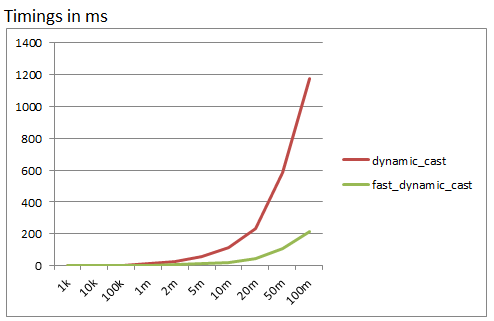
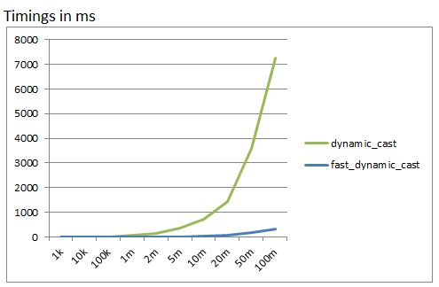
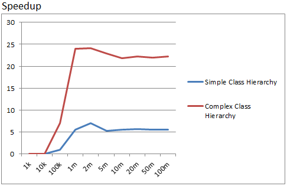

# Fast dynamic cast

This is a dynamic cast implementation which outperforms the regular `dynamic_cast` by up to 25 times.


# Performance

All performance tests ran on 2 Xeons E5-2623, but should be representative for lower end systems too.
I ran each iteration count multiple times, and took the average.

The solution used to measure the performance can be found in `dcast_performance`.

Notice that all performance tests are more or less best-case scenarios which only perform dynamic_cast (Also see How it works).

## Simple class hierarchy




## Complex class hierarchy




## Speedup vs regular dynamic_cast




# Usage

Copy the `fast_dynamic_cast.h` header to your project, and change your `dynamic_cast` calls to `fast_dynamic_cast`, e.g.:

```cpp
A a;
B& a_as_b = a;
A& a_as_a = fast_dynamic_cast<A&>(a_as_b);
```

The syntax is identical to the regular dynamic cast.

The dynamic cast implementation only works on MSVC 2013 or newer. For all other compilers,
it will fallback to the default dynamic cast.

# How it works

The dynamic cast has two tasks to do:

- Ensure the object is related and castable to the requested type
- Move the pointer so it points to the requested class block.

The fast dynamic cast is built on top on the regular dynamic cast.
It improves performance by observing that, after we ensured the class is convertible,
we can cache the offset required to shift the pointer.

For example, assuming we have a `class A` and `B`, whereas `B` derives from `A`, and we want to cast an `A pointer` to a `B pointer`.
The first time this cast is invoked, the fast dynamic past uses the regular dynamic cast to
retrieve the casted pointer.

Lets say the dynamic cast shifted the A pointer by `+8`, then the fast dynamic cast stores this offset.
The next time the cast is invoked, the incoming pointer is just shifted by `+8` and returned, which is much faster
and avoids the `dynamic_cast` call.

However, there are two cases where this approach cannot be used:

- The pointer passed in is not actually castable
- The pointer is already shifted

Case 2 can occur, if we for example call `fast_dynamic_cast<A*>(B*)`, but the passed pointer
points to a derived `C` class (whereas `C` derives from `B`). This is a problem, since the
offset from `C -> A` is different than the offset from `B -> A`.

The fast dynamic cast solves both problems by additionally also storing the VTable pointer in the cache.
When an object is casted, the fast dynamic cast only detects a cache hit if the vtable
pointer matches, and if not, performs the regular dynamic cast.

In theory, casting many different objects to the same superclass would then be even less performant
than the regular dynamic cast.

However, in practice, the cache usage is over 95%, and thus the fast dynamic cast is up to a order
of magnitude faster than the regular dynamic cast. 

